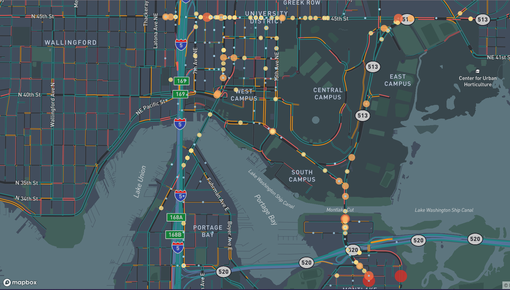
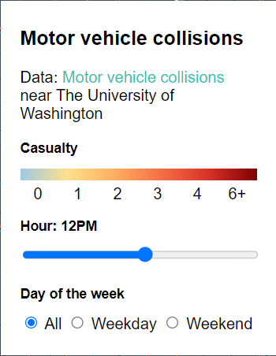

# Commuter Collisions Near the University of Washington

*An interactive web map exploring traffic collisions around the UW Seattle campus by time of day and day of week.*

## Project Description

This project is an analysis of motor vehicle collisions associated with commuting to and around the University of Washington (UW) Seattle campus. Using historical collision records from the Seattle Department of Transportation (SDOT), the web map visualizes when and where traffic-related incidents occur in the areas most heavily used by daily commuters, including students, faculty, staff, and surrounding residents. That is, roads and areas around and a part of UW campus.

The study area focuses on major commuter corridors and neighborhoods such as University District, West Campus, East Campus, Montlake, and nearby segments of I-5 and SR-520. These locations experience high traffic volumes due to class schedules and work hours, making them particularly relevant for understanding collision risk.

Collisions are represented as point features and symbolized according to severity, combining injury and fatality counts under casualties to scale circle size and color intensity. Interactive controls allow users to filter collisions by hour of day and by weekday versus weekend, revealing notable patterns such as peak commute hours or differences between weekday and weekend business.

By transforming static collision records into an interactive time map, this project lets users explore how commuting patterns intersect with traffic safety near UW. The visualization is intended to support personal awareness for commuters while also providing contextual insight into when and where collisions are most likely to occur.

## Favicon

This project uses a custom favicon to represent motor vehicle collisions near the UW campus:

## Project Goal

As a daily commuter to the University of Washington, this project comes from direct experience with recurring traffic delays and unexpected congestion near campus. On multiple occasions, commute times were significantly impacted by collisions or sudden traffic slowdowns, which resulted in late arrivals and major inconveniences. These repeated experiences highlighted how difficult it can be for commuters to anticipate risk without access to clear, spatially contextualized information.

The primary goal of this project is to provide an interactive mapping tool that allows commuters to better understand when and where collision disruptions are most likely to occur. By visualizing historical collision patterns by time of day and day of week, the map enables users to identify risky periods and corridors and adjust their routes or timing accordingly.

While the application does not predict future incidents, it offers a perspective on consistent patterns that may influence route selection, departure times, and general awareness for those traveling to and around the UW campus. In this way, the project bridges personal commuting experience with broader spatial analysis to support more informed and resilient travel planning.

## Application URL

The live web map is hosted on GitHub Pages at:
https://keith123uw.github.io/uw-commuters/index

## Screenshots

*Main map view showing collision points and the sidebar legend.*

*Time-of-day slider and weekday/weekend filters highlighting peak collision hours.*

## Main Functions

- **Time-of-day filter:** slider to view collisions occurring at specific hours (0–23) using derived time attributes.
- **Day-of-week filter:** toggle between all days, weekdays, and weekends using a combined filter expression.
- **Severity visualization:** collisions symbolized by combined injury and fatality counts using a red-anchored color ramp and scaled circle sizes.
- **Focused study area:** map centered on the UW Seattle campus and key commuter corridors such as I-5 and SR-520.

## Data Sources

- **SDOT Collisions – All Years (Seattle GeoData)**
  https://data-seattlecitygis.opendata.arcgis.com/datasets/SeattleCityGIS::sdot-collisions-all-years

## Applied Libraries and Web Services

- **Mapbox GL JS** – used for rendering the interactive web map, custom layer styling, and filter expressions.
- **Mapbox Navigation Night basemap** – underlying basemap style providing road network context for the UW area.
- **GitHub Pages** – static hosting for the web application and GeoJSON data.
- **Mapbox Show Changes Over Time Tutorial** – essential template used for this project.

## Acknowledgments

Mapbox "Show changes over time with Mapbox" template and tutorial was essential to the making of this website.

## AI Use Disclosure

ChatGPT used for favicon generation and casualty color ramp.

## Additional Notes

-
